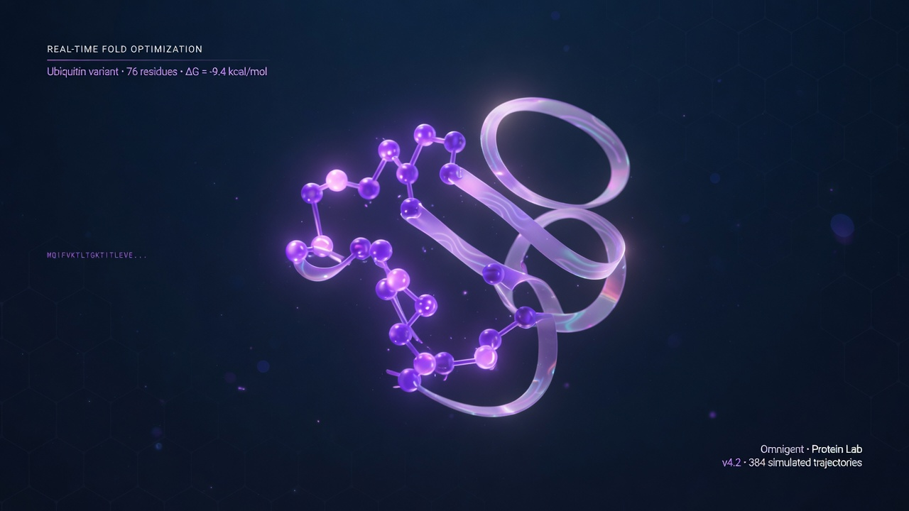

# Omnigent Protein Lab

A simple, visual demo of **[Omnigent](https://docs.databricks.com/aws/en/omnigent/)** (Databricks’ open meta-harness for AI agents) applied to **protein structure visualization** — with optional **[Boltz](https://github.com/jwohlwend/boltz)** prediction and a rotating structure movie.

<p align="center">
  
</p>

```
sequence  →  predict (Boltz or RCSB demo)  →  3D still  →  spin movie
                 ↑
         Omnigent agent (YAML + Python tools)
```

[Omnigent on Databricks](https://docs.databricks.com/aws/en/omnigent/) · [omnigent.ai](https://omnigent.ai/) · [Boltz](https://github.com/jwohlwend/boltz)

---

## What’s in the box

| Path | Role |
|------|------|
| `agents/protein-lab/` | Omnigent custom agent (`config.yaml` + skills notes) |
| `tools/protein_tools.py` | Tools the agent calls: predict, render, movie |
| `demo/run_demo.py` | **Offline walkthrough** — same pipeline, no LLM keys |
| `scripts/make_promo_storyboard.py` | Stitches a multi-scene promo MP4 |
| `outputs/` | Structures, PNGs, MP4s (generated) |

### Curated demo proteins

- **ubiquitin** (`1UBQ`) — classic 76-aa fold
- **crambin** (`1CRN`) — tiny crystallography favorite
- **insulin** (`2HIU`)
- **hemoglobin** (`2HHB`)
- **gfp** (`1EMA`) — green fluorescent protein

---

## Quick start (no Omnigent required)

```bash
cd protein-folding-fun
uv venv .venv && source .venv/bin/activate
uv pip install -e .

# Fold ubiquitin + render still + spin movie (~30s)
python -m demo.run_demo --target ubiquitin

# Everything
python -m demo.run_demo --all --frames 60

# Multi-scene promo film (title → sequence → spin → outro)
python scripts/make_promo_storyboard.py --target ubiquitin
```

Open:

- `outputs/ubiquitin/ubiquitin_still.png` — hero still
- `outputs/ubiquitin/ubiquitin_spin.mp4` — 360° backbone spin
- `outputs/omnigent_protein_lab_ubiquitin_promo.mp4` — multi-scene promo film
- `demo/viewer.html` — interactive 3Dmol.js viewer (open in a browser)

---

## Run with Omnigent

Install Omnigent ([docs](https://omnigent.ai/quickstart/install) / [Databricks managed](https://docs.databricks.com/aws/en/omnigent/quickstart)):

```bash
curl -fsSL https://omnigent.ai/install.sh | sh
omnigent setup          # provider keys / Databricks workspace
```

From this repo (so `tools.*` import paths resolve):

```bash
cd protein-folding-fun
source .venv/bin/activate   # has biopython, matplotlib, ...
export PYTHONPATH=$PWD

omni run ./agents/protein-lab
```

Then chat, for example:

> Fold ubiquitin and make a spin movie  
> Show me GFP  
> Predict structure for MQIFVKTLTGKTITLEVEPSDTIENVKAKIQDKEGIPPDQQRLIFAGKQLEDGRTLSDYNIQKESTLHLVLRLRGG

The agent will call the same tools as `demo/run_demo.py` and drop artifacts under `outputs/`.

### Swap the harness

In `agents/protein-lab/config.yaml`, change one line:

```yaml
executor:
  type: omnigent
  config:
    harness: claude-sdk   # or: codex, pi, grok, openai-agents, ...
```

Tools, prompt, and policies stay the same — that is the point of Omnigent’s meta-harness layer.

---

## Boltz API e2e (cloud structure + binding)

Live demo: peptide + **aspirin** via the official [boltz-api](https://lab.boltz.bio) CLI.

```bash
# install once
curl -fsSL https://install.boltz.bio/boltz-api/install.sh | sh

# auth (API key OR device login — never commit keys)
export BOLTZ_API_KEY='sk_bc_...'   # admin/workspace key
# boltz-api auth login --device-code

# run prediction → download CIF → still + spin movie
./scripts/run_boltz_e2e.sh
# or:
.venv/bin/python -m demo.run_boltz_e2e
```

Input is `prediction-input.json`:

```json
{
  "entities": [
    { "type": "protein", "value": "MKTIIALSYIFCLVFA", "chain_ids": ["A"] },
    { "type": "ligand_smiles", "value": "CC(=O)OC1=CC=CC=C1C(=O)O", "chain_ids": ["B"] }
  ]
}
```

Artifacts from a successful run:

| Path | What |
|------|------|
| `outputs/boltz-e2e/aspirin-peptide-demo/` | Raw Boltz run (CIF, metrics, archive) |
| `outputs/boltz-aspirin-peptide/*_spin.mp4` | Rotating complex movie |
| `outputs/omnigent_boltz_e2e_promo.mp4` | Multi-scene promo film |
| `outputs/boltz_e2e_session.json` | Session summary (metrics + paths) |

Example confidence from a live run: **structure_confidence ≈ 0.75**, **complex_plddt ≈ 0.84**.

### Local Boltz package (optional)

Offline/local GPU path with the open-source package:

```bash
pip install boltz
python -m demo.run_demo --engine auto --target crambin
```

`predict_structure(engine="auto")` tries local Boltz first, then RCSB.

---

## How the Omnigent agent is defined

Custom agents are **YAML** — no framework subclassing ([custom agents docs](https://omnigent.ai/docs/use/custom-agents)):

```yaml
# agents/protein-lab/config.yaml (excerpt)
name: protein-lab
executor:
  type: omnigent
  config:
    harness: claude-sdk
tools:
  predict_structure:
    type: function
    callable: tools.protein_tools.predict_structure
  make_structure_movie:
    type: function
    callable: tools.protein_tools.make_structure_movie
```

On Databricks, the same agent can run under the managed Omnigent server with AI Gateway model access and optional Databricks Sandbox isolation.

---

## ⭐ Flagship film (retention-grade · multi-audience)

**Ship this:** `outputs/BEAST_omnigent_boltz_glp1_demo.mp4`  
(also `FINAL_omnigent_glp1_demo.mp4` / `omnigent_glp1_hormone_e2e_demo.mp4`)

```bash
# keys: .env ELEVENLABS_API_KEY · boltz-api auth
.venv/bin/python scripts/compose_beast_e2e.py
open outputs/BEAST_omnigent_boltz_glp1_demo.mp4
```

### Story spine (meaning + value)

| Beat | Hook craft | Value delivered |
|------|------------|-----------------|
| **Cold open** | “Dies in **120 seconds**” + $B drug stakes | Instant curiosity gap |
| **Promise** | 3 things / under 2 min | Sets contract with viewer |
| **BIO** | 30-letter GLP-1 · DPP-4 · insulin/appetite | Correct biocomputing story |
| **Stakes** | Natural ~2 min vs engineered **days** | Why structure/half-life matter |
| **ENG** | One-line harness swap · policies as code | Steal-able Omnigent pattern |
| **Product** | Real Omnigent UI (Share, Agents, policies) | Tech/product truth |
| **BOLTZ** | Live **0.83** / **0.90** pLDDT · not a mock | Scientific proof |
| **Fold** | Premium all-atom spin of **our** CIF | Visual payoff |
| **Everyone** | Bio / eng / leaders / scientists scoreboard | Explicit multi-audience value |
| **CTA** | `omni run ./agents/protein-lab` | One clear next step |

**Runtime ~2:18** · 1080p · ElevenLabs Liam (energetic) · loudnorm+compression  
**Script:** `demo/vo_script_beast.json` · **Composer:** `scripts/compose_beast_e2e.py`

Retention practices applied (tech-safe): front-load number hooks, re-hook every chapter, proof before pitch, pattern interrupts with real UI, clean CTA while energy is high.

## Product UI demo (Omnigent by Databricks)

**This is the one that shows the product** — real Omnigent workspace UI, policies, Share, Agents panel, and a Protein Lab session with tool cards:

```bash
.venv/bin/python scripts/build_omnigent_ui_demo.py
open outputs/omnigent_databricks_protein_lab_ui_demo.mp4   # ~52s, 1080p
```

| Beat | What you see |
|------|----------------|
| Brand | Omnigent on Databricks |
| Workspace carousel | Official docs UI (`docs.databricks.com`) |
| Composition / Control / Collaboration | Real product screenshots from omnigent.ai |
| Architecture | Interfaces → server → sandbox → harnesses → tools |
| YAML agent | `agents/protein-lab/config.yaml` |
| Live session mock | Chat · tool cards · Agents · policies · Share |
| Boltz metrics | confidence / pLDDT + structure pane |
| CTA | `omni run ./agents/protein-lab` |

Poster: `docs/assets/omnigent_ui_demo_poster.png`

## Launch montage (structure cuts)

Structure-only reel cut with [video-use](https://github.com/browser-use/video-use):

```bash
./scripts/render_launch_video.sh
open outputs/omnigent_protein_lab_launch.mp4
```

---

## License

Demo code is yours to reuse. Boltz, RCSB PDB, and Omnigent have their own licenses — check upstream projects before redistribution of predicted structures or binaries.
